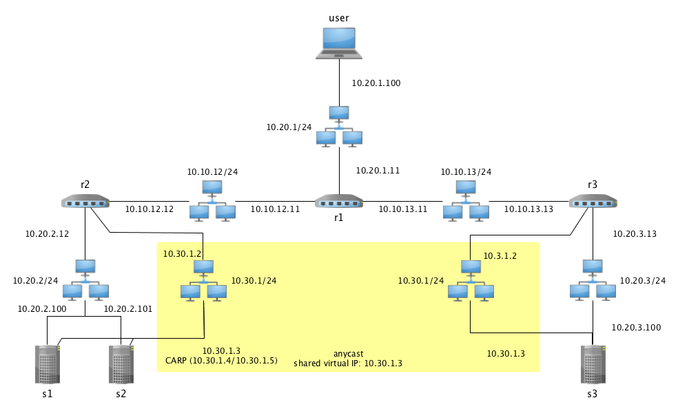

# Anycast BGP 

Vagrant-based Lab Anycast via BGP Routing (using OpenBSD) + Failover (at one site) via CARP

## Prequisites

- Vagrant (Tested with Version 1.7.2)
- Virtualbox (Tested with Version 4.3.26)

## Getting started

Start all VMs and provision with configuration for this test environment.

    $ vagrant up

This will launch seven VMs running OpenBSD. 

- 3 Router nodes running OpenBGPD
- 2 Server nodes at site A (linked via CARP for HA/Failover)
- 1 Server node at 'fallback' site B
- 1 User node

The VMs are fairly small and fast to boot up. However they contain 
all necessary software for BGP, CARP etc.. here.

```
      user
       |
   r2--r1--r3
   |        |
   |        |
+--+--+     |
|     |     |
s1   s2    s3
```

BGP Routers: r1-r3
Servers:     s1/s2 carp, s3

Common IP: 10.30.1.3

Site A and Site B share a common virtual IP `10.30.1.3` as depict
in the 

A detailed display of the topology is given in the next figure:



## Tests

Login to the user node.

    @host $ vagrant ssh user

Then traceroute the shared ip.

    @user $ traceroute 10.30.1.3

Output:

    traceroute to 10.30.1.3 (10.30.1.3), 64 hops max, 40 byte packets
     1  10.20.1.11 (10.20.1.11)  0.701 ms  0.562 ms  0.416 ms
     2  10.10.12.12 (10.10.12.12)  0.705 ms  1.064 ms  0.645 ms
     3  10.30.1.3 (10.30.1.3)  0.812 ms  0.969 ms  0.673 ms

Now run a `ping` to the shared IP and open another terminal for the following
steps to observe fallout effects.

    user $ ping 10.30.1.3

Switch off router `r2` to simulate network fallout and failover via BGP/Anycast for shared IP.

    [Open new terminal]
    host $ vagrant suspend r2

Bring back `r2`.
 
    host $ vagrant resume r2
   
Service failover via CARP: Now we switch off `s1` to simulate service fail-over on Site A:
    
    host $ vagrant suspend s1

